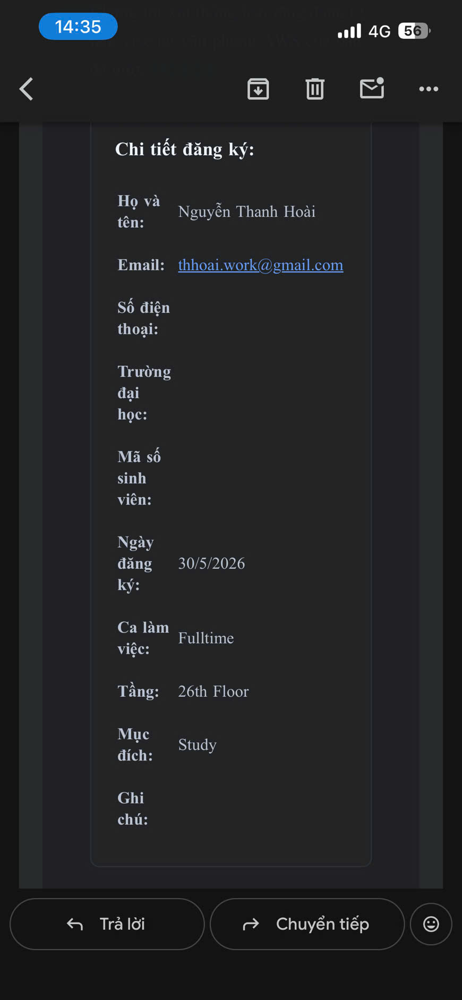

# Event 1: Sharing & Reflection Meeting on AWS Internship Program

### General Information

* **Attendance Date:** May 30, 2026
* **Location:** 26th Floor, Bitexco Tower, Ho Chi Minh City
* **Shift:** Fulltime
* **Role:** Attendee

---

### Event Objectives

* Listen to shares from mentors, admins, and former interns about practical work experience at AWS.
* Interact and connect with other interns in the same batch.
* Share personal reflections, difficulties, and advantages during the first month of internship.

---

### Content and Personal Experience

The first meeting gave me a very warm and close feeling. Unlike the stress of daily technical work, this was a time for everyone to sit down and share real stories about the journey of getting used to the corporate environment.

I was particularly impressed with the sharing about the working culture at AWS, effective time management, and the spirit of self-learning. The event helped me better understand my personal development path and have a clearer direction for the upcoming internship period. The spiritual values and connections from this meeting are a wonderful start to my internship journey.

